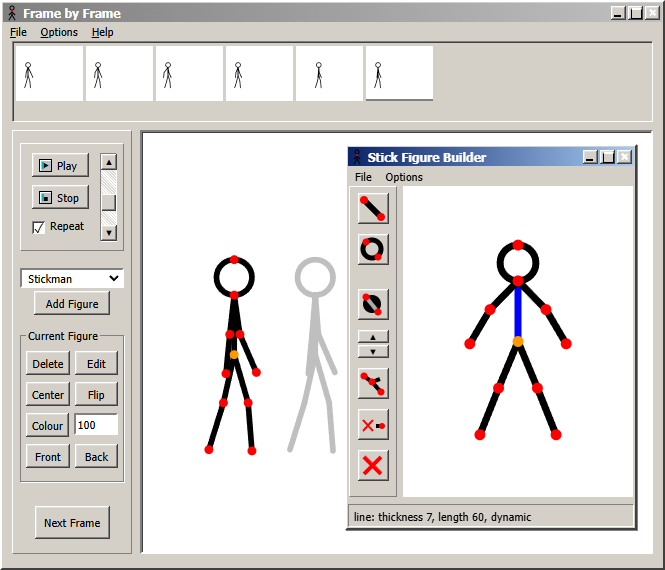

# Frame by Frame

A runnable browser stick-figure animation editor MVP with classic desktop chrome closely matched to a supplied Pivot reference screenshot. Gray beveled panels, compact File/Options/Help menus, the top thumbnail strip, left controls and a floating blue-title-bar Stick Figure Builder replace the initial modern design. All JavaScript and vector icons are independently implemented. This is an unofficial project, not Pivot Animator.

## Run locally

Install Node.js 18 or newer, then run these commands in this directory:

```sh
npm start
```

Open http://127.0.0.1:4173. No dependency installation, account, or API key is required. The server binds to localhost. Set the `PORT` environment variable if 4173 is occupied.

## Make an animation

1. Drag a red joint to rotate a segment and its descendants. Limb lengths stay fixed while posing.
2. Drag the orange hip to move the entire figure.
3. Click **Next frame** to copy the pose, then adjust it. The previous pose appears as an onion skin.
4. Select timeline thumbnails to edit earlier frames. Play your sequence and adjust speed from 1–30 fps with the vertical slider beside Play and Stop. Repeat toggles looping.
5. Use **File → Save animation** to download editable JSON. **Open animation** restores that format. **Export frame PNG** exports the current frame without handles.

Additional controls include figure duplication/deletion, colour, numeric scale, horizontal flip, centering, Front/Back ordering, frame duplication/deletion, undo, looping, and a six-frame example. File and Options contain the less-used commands. Space toggles playback, arrow keys navigate frames (right at the end adds a frame), and Ctrl/Cmd+Z undoes edits. Ctrl/Cmd+S saves and Ctrl/Cmd+O opens a project.

**Edit** opens the movable Stick Figure Builder. Select and drag a joint to alter its length, then use the toolbar to change line/circle shape, circle fill, thickness, static state, or hide/restore limbs. Closing with × applies changes as one undoable edit; File → Close without applying discards them. The builder initially shows the figure's template shape; applying a changed template also uses that shape as the current pose. Opening and closing without edits preserves the existing pose. Its minimize/maximize controls work, as do the main window's minimize/restore controls.

The first visit opens the six-frame example and builder to reproduce the reference composition. Existing autosaved projects are restored without replacement. The scene is drawn in an 800 × 660 coordinate space with uniform scaling.

Projects autosave in the current browser when storage is available. Download JSON for a durable copy; browser data can be cleared or unavailable.

## Sources and scope

Behavior and layout research used the original product's official documentation:

- [Pivot Animator documentation](https://www.pivotanimator.net/help5-1/)
- [Figure handle and onion skin options](https://www.pivotanimator.net/help4-2/options.htm)
- [Animation frame controls](https://w.pivotanimator.net/help5-2/animation_frame_controls.htm)

The top thumbnail timeline, left control panel, red segment handles, orange origin handle, and copy-then-pose workflow reflect those documented interactions. No original program code, bundled figures, sprites, audio, or proprietary files are included.

This prototype supports at most 500 frames and 50 figures per frame; opened JSON files are limited to 5 MB and validated before loading. Earlier MVP JSON remains supported. The builder edits the existing 11-joint skeleton; it does not add arbitrary joints. It does not support `.piv` or `.stk` files, GIF/video export, frame interpolation, or full desktop feature parity. PNG export is a single frame. A mouse and wider screen make detailed posing easier.

## Verification

Run `npm run check` for syntax checks. Real-browser checks cover the reference-size layout, builder editing/apply/undo, hip dragging, adding frames, playback, JSON round trips, earlier JSON compatibility and invalid input rejection. This is an MVP, not a complete reproduction of the desktop application.

## Preview



[Larger desktop screenshot](desktop.png) · [Narrow viewport screenshot](mobile.png)

See [verification notes](VERIFICATION.md) for tested behavior and limits.
