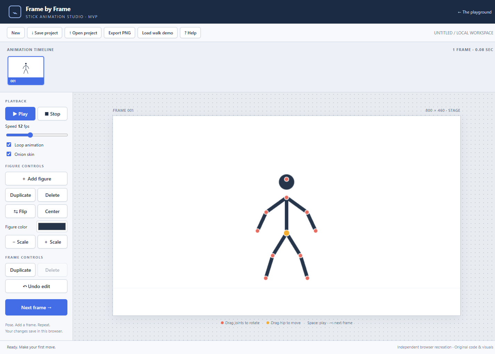

# Frame by Frame

A runnable browser stick-figure animation editor MVP. It recreates familiar Pivot-style posing and frame workflows using independent vanilla JavaScript and original visuals. This is an unofficial project, not Pivot Animator.

## Run locally

Install Node.js 18 or newer, then run these commands in this directory:

```sh
npm start
```

Open http://127.0.0.1:4173. No dependency installation, account, or API key is required. The server binds to localhost. Set the `PORT` environment variable if 4173 is occupied.

## Make an animation

1. Drag a red joint to rotate a segment and its descendants. Limb lengths stay fixed while posing.
2. Drag the orange hip to move the entire figure.
3. Click **Next frame** to copy the pose, then adjust it. The previous pose appears as an onion skin.
4. Select timeline thumbnails to edit earlier frames. Play your sequence and adjust speed from 1–30 fps.
5. Use **Save project** to download an editable JSON project. **Open project** restores that format. **Export PNG** exports the current frame without handles.

Additional controls include figure duplication/deletion, color, scale, horizontal flip, centering, frame duplication/deletion, undo, looping, and a 12-frame walk demo. Space toggles playback, arrow keys navigate frames (right at the end adds a frame), and Ctrl/Cmd+Z undoes edits.

Projects autosave in the current browser when storage is available. Download JSON for a durable copy; browser data can be cleared or unavailable.

## Sources and scope

Behavior and layout research used the original product's official documentation:

- [Pivot Animator documentation](https://www.pivotanimator.net/help5-1/)
- [Figure handle and onion skin options](https://www.pivotanimator.net/help4-2/options.htm)
- [Animation frame controls](https://w.pivotanimator.net/help5-2/animation_frame_controls.htm)

The top thumbnail timeline, left control panel, red segment handles, orange origin handle, and copy-then-pose workflow reflect those documented interactions. No original program code, bundled figures, sprites, audio, or proprietary files are included.

This prototype supports at most 500 frames and 50 figures per frame; opened JSON files are limited to 5 MB and validated before loading. It does not support `.piv` or `.stk` files, custom skeleton construction, GIF/video export, frame interpolation, or full desktop feature parity. PNG export is a single frame. Joint dragging is supported on touch screens, though a mouse and wider screen make detailed posing easier.

## Verification

The script passed a JavaScript syntax check. Local browser checks covered hip dragging, adding and duplicating frames, and playback. This is an MVP, not a complete reproduction of the desktop application.

## Preview



See [verification notes](VERIFICATION.md) for tested behavior and limits.
