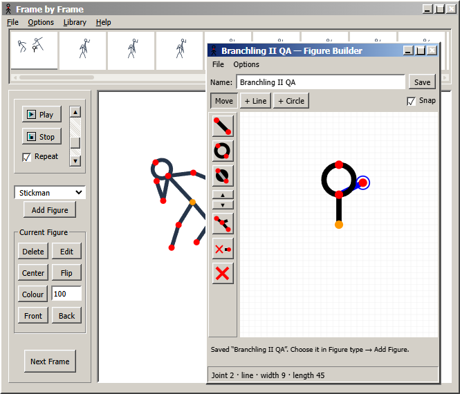

# Frame by Frame

A runnable browser stick-figure animation editor MVP with classic desktop chrome closely matched to a supplied Pivot reference screenshot. Gray beveled panels, compact File/Options/Help menus, the top thumbnail strip, left controls and a floating blue-title-bar Stick Figure Builder replace the initial modern design. All JavaScript and vector icons are independently implemented. This is an unofficial project, not Pivot Animator.

## Run locally

Install Node.js 18 or newer, then run these commands in this directory:

```sh
npm start
```

Open http://127.0.0.1:4173. No dependency installation, account, or API key is required. The server binds to localhost. Set the `PORT` environment variable if 4173 is occupied.

## Make an animation

1. Pull a red hand or foot to bend its limb, keeping the torso and other branches planted. Lengths stay fixed, including when the pointer moves beyond reach. Options → Pull joints switches between this behavior and classic branch rotation. Shift-click a joint to pin/release it (blue); Options → Release figure pins clears pins on the selected figure. Moving the orange origin translates the entire figure, including pins.
2. Drag the orange hip to move the entire figure.
3. Click **Next frame** to copy the pose, then adjust it. The previous pose appears as an onion skin.
4. Select timeline thumbnails to edit earlier frames. Play your sequence and adjust speed from 1–30 fps with the vertical slider beside Play and Stop. Repeat toggles looping.
5. Use **File → Save animation** to download editable JSON. **Open animation** restores that format. **Export frame PNG** exports the current frame without handles.

Additional controls include figure duplication/deletion, colour, numeric scale, horizontal flip, centering, Front/Back ordering, frame duplication/deletion, undo, looping, and a six-frame example. File and Options contain the less-used commands. Space toggles playback, arrow keys navigate frames (right at the end adds a frame), and Ctrl/Cmd+Z undoes edits. Ctrl/Cmd+S saves and Ctrl/Cmd+O opens a project.

**File → Create figure** starts a blank figure with an orange origin. Select a joint, choose **+ Line** or **+ Circle**, then click empty space to add a connected segment. Each endpoint is another joint; click an existing joint to start a new branch. **Move** drags only the selected joint (the origin translates the whole draft). **Snap** aligns to existing joint positions and a 10-unit grid; coincident endpoints remain distinct joints, and connections form a tree, not closed constraint loops. Figures can contain 1–128 joints.

Name the figure and click **Save** to store a reusable character in the local library and sidebar figure picker. The builder's File menu also exports portable figure JSON; the main **File → Open figure** opens it for editing. Closing with × applies the draft to the current frame as one undoable edit. File → Close without applying discards the draft. Builder Ctrl+Z undoes individual construction edits; Ctrl+S saves the draft to the library. A repeated save creates a numbered copy, preserving earlier versions.

**Edit** opens the selected figure in its current pose. The toolbar changes shape, fill, thickness and static state, or hides/restores a branch. Builder Options can delete a branch, reset to stickman, and undo edits. Tool windows still drag over the menus and timeline and support minimize/maximize.

**Options** has persistent toggles for onion skins, pull joints, handles, grid and 15-degree rotation snapping. Alt-drag also snaps a rotation. The animation-speed item opens an editable 1–30 fps dialog with a duration preview; Cancel leaves the speed unchanged, and Apply is undoable. Frame and figure duplication/deletion, scaling and Undo work on the current frame.

The first visit opens the six-frame example and builder to reproduce the reference composition. Existing autosaved projects are restored without replacement. The scene is drawn in an 800 × 660 coordinate space with uniform scaling.

## Characters, rigs and animation library

The **Library** menu opens a classic modeless window with **Characters**, **Rigs**, and **Animations** tabs. It includes search, item thumbnails, an animation preview, naming, rename/delete controls, and library file import/export.

- **Characters** save a figure's current pose, colour, and segment appearance. Saved characters are also available in the sidebar's Add Figure selector.
- **Rigs** save template geometry, segment thickness, shapes, and static/hidden joint settings. Save from the Library menu; the builder’s Save button stores a character including its geometry. Rigs are stored in neutral black and can be inserted and posed again.
- **Animations** save the complete current timeline and frame rate. Six original starter clips are included: Walk, Run, Wave, Jump, Idle / breathe, and Bow.
- **Preview** plays a clip inside the library without changing the stage. **Open animation** replaces the current timeline after confirmation; Undo restores its previous frames and frame rate.
- **Append clip** inserts frames after the current frame. With **Use selected character when appending** checked, a single-character clip with a matching joint layout uses the selected character's appearance and rig lengths; other figures stay in place. Without it, the clip's scene is inserted with fresh figure IDs. Appended clips use the current timeline's frame rate.
- **Export library** downloads a portable JSON backup. **Import library** validates and merges a backup, keeping existing items and numbering duplicate names. It does not overwrite the current animation.

Library saves remain in this browser's storage: no accounts, uploads or cloud synchronization. Export for a durable backup or transfer between browsers. The saved library is limited to 120 assets and 4 MB; a full/unavailable browser store produces a visible error instead of claiming the save succeeded. Built-in items cannot be renamed or deleted.

The figure builder is a viewport-level window above the library and the rest of the editor. It can be dragged across menus, the frame strip and side panels. Both tool windows minimize/maximize and remain within the browser viewport when resized. They are app windows, not operating-system windows.

## Design direction

Future features retain this classic gray, beveled desktop language. The repository's AGENTS.md records the owner's preference so later work preserves the chrome and floating-window behavior.

Projects autosave in the current browser when storage is available. Download JSON for a durable copy; browser data can be cleared or unavailable.

## Sources and scope

Behavior and layout research used the original product's official documentation:

- [Pivot Animator documentation](https://www.pivotanimator.net/help5-1/)
- [Figure handle and onion skin options](https://www.pivotanimator.net/help4-2/options.htm)
- [Animation frame controls](https://w.pivotanimator.net/help5-2/animation_frame_controls.htm)

The top thumbnail timeline, left control panel, red segment handles, orange origin handle, and copy-then-pose workflow reflect those documented interactions. No original program code, bundled figures, sprites, audio, or proprietary files are included.

This prototype supports at most 500 frames and 50 figures per frame; opened JSON files are limited to 5 MB and validated before loading. Earlier MVP JSON remains supported. Custom figures use ordered joint trees with up to 128 joints. Pull mode solves an endpoint chain up to the nearest branch or pinned/static ancestor; it is limb IK, not a full-body physics solver. Dragging an elbow or knee changes its bend in either direction: the shoulder/hip stays planted and the hand/foot adjusts by the minimum distance needed to preserve the lower bone length. Other non-endpoint dragging rotates the child branch. A pinned descendant locks that branch against rotation. Animation reuse requires matching topology when retargeting; incompatible clips can still append their original actors by unchecking Use selected character. It does not support `.piv` or `.stk` files, GIF/video export, frame interpolation, or full desktop feature parity. PNG export is a single frame. A mouse and wider screen make detailed posing easier.

## Verification

Run `npm run check` for syntax checks. Real-browser checks cover the reference-size layout, builder editing/apply/undo, hip dragging, adding frames, playback, JSON round trips, earlier JSON compatibility and invalid input rejection. This is an MVP, not a complete reproduction of the desktop application.

## Preview



[Classic reference-size chrome](classic-reference-size.png) · [Builder above the menus](floating-builder.png) · [Narrow library viewport](library-mobile.png)

See [verification notes](VERIFICATION.md) for tested behavior and limits.


## Production deployment

The intended public URL is https://animator.alirezaafshan.com/. The app stays entirely in-browser; the VPS only serves static application files. Saves are per browser origin. Export projects/libraries on localhost and import them on the public site to move your own work.

`npm run build` produces an allowlisted `dist/` with a Git-SHA build manifest. The Dockerfile serves this directory as an unprivileged Node user on port 3000. `/healthz` reports readiness and the exact release SHA; `/build.json` includes release provenance and application-file hashes. Only runtime assets and metadata are served, not source configuration, deployment scripts or Git files.

GitHub Actions runs the geometry/syntax checks, builds the container, and checks its readiness, release SHA, metadata, icons and route exclusions. After the operator completes `deployment/setup-vps.py` and the repository variable `DEPLOY_ENABLED` is `true`, successful `main` pushes send an HMAC-signed request to Deploy Manager and wait for the terminal receipt and matching public HTTPS SHA. Pull requests run validation only. GitHub secrets are `DEPLOY_WEBHOOK_URL` and `DEPLOY_WEBHOOK_SECRET`; no values belong in this repository.

The reviewed configuration in `deployment/` adds app `animator` on loopback ports 3090/3091, checkout `/opt/frame-by-frame/app`, and the Caddy hostname. Its setup script backs up and merges existing configuration, keeps existing app containers untouched, and restores configuration if manager/proxy activation fails. It requires an interactive sudo step. Future releases use the manager's existing candidate-check/swap/rollback path; first deployment has no previous animator image to restore. See the deployment receipt for live verification status.
